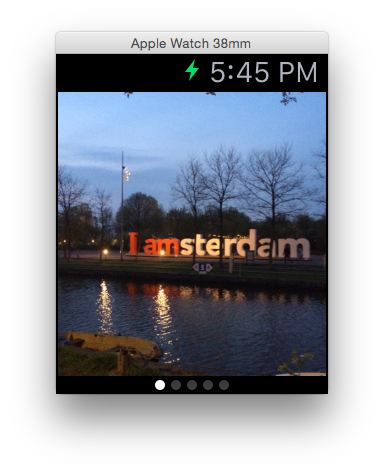
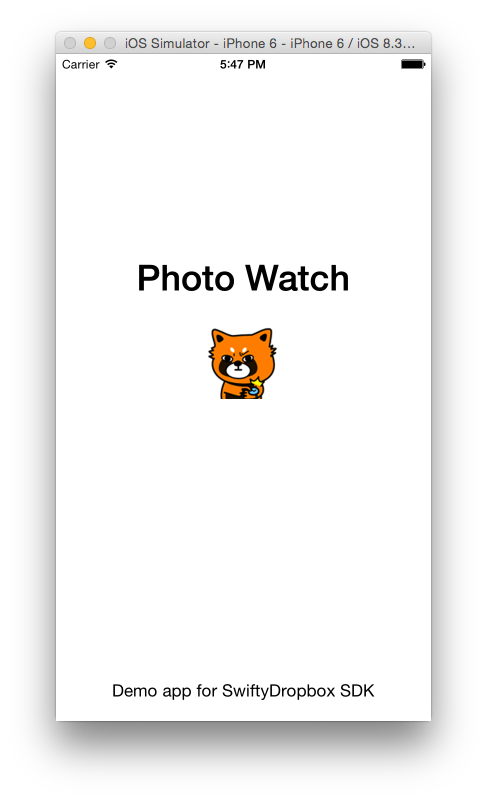
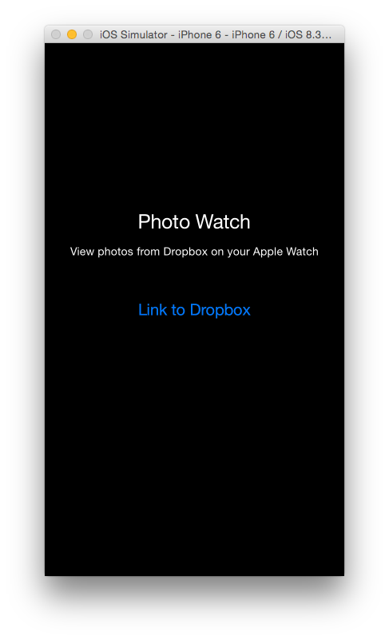
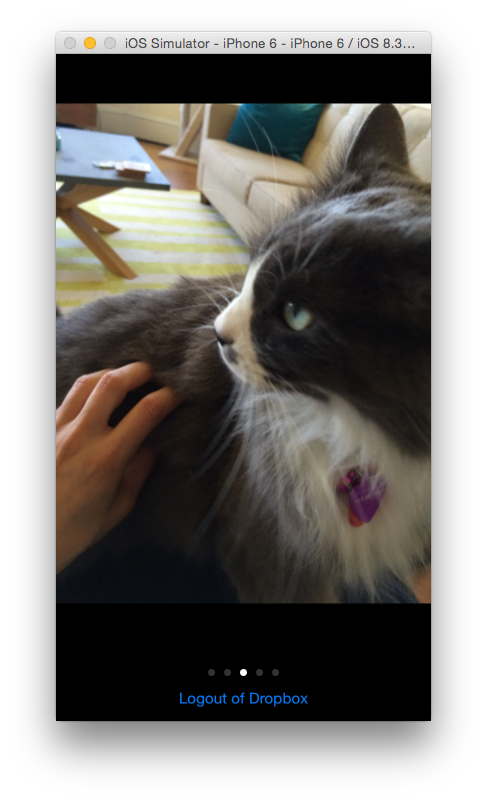

# PhotoWatch
A demo app for the [SwiftyDropbox](https://github.com/dropbox/SwiftyDropbox) SDK. Read more about SwiftyDropbox on our [developer blog](https://blogs.dropbox.com/developers/2015/05/try-out-swiftydropbox-the-new-swift-sdk-for-dropbox-api-v2/).

### Getting started

To install all project dependencies, run `pod install` from the root directory.

### Apple Watch

### iPhone

